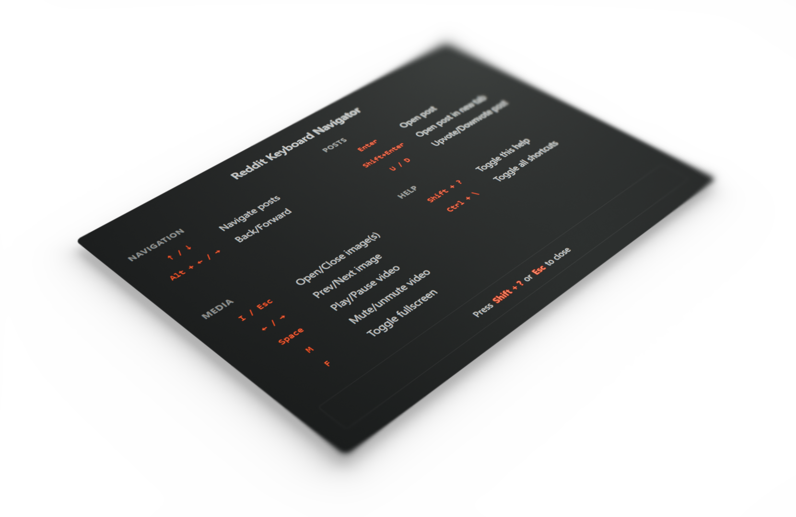

# Reddit Keyboard Navigator

Enhanced keyboard navigation for Reddit.com. This Chrome extension lets you quickly browse, open, and interact with Reddit posts and media using your keyboard.

## Features

- **Navigate posts** with ↑ / ↓
- **Back/Forward** with Alt + ← / →
- **Open posts** with Enter (current tab) or Shift + Enter (new tab)
- **Upvote/Downvote post** with U / D
- **Open/Close image(s)** with I / Esc
- **Prev/Next image** with ← / →
- **Play/Pause video** with Space
- **Mute/Unmute video** with M
- **Toggle fullscreen** with F
- **Quick help overlay** with Shift + ?
- **Toggle all shortcuts** with Ctrl + \

## Installation

1. Download or clone this repository.
2. Go to `chrome://extensions` in your browser.
3. Enable "Developer mode" (top right).
4. Click "Load unpacked" and select this folder.

## Usage

- Visit Reddit.com and use the keyboard shortcuts above.
- An indicator appears in the bottom right with a help shortcut.
- Press **Shift + ?** anytime to view all shortcuts.

## Files

- `manifest.json` – Chrome extension manifest
- `content.js` – Main script for keyboard navigation
- `styles.css` – Extension styles
- `icons/` – Extension icons

---

MIT License
